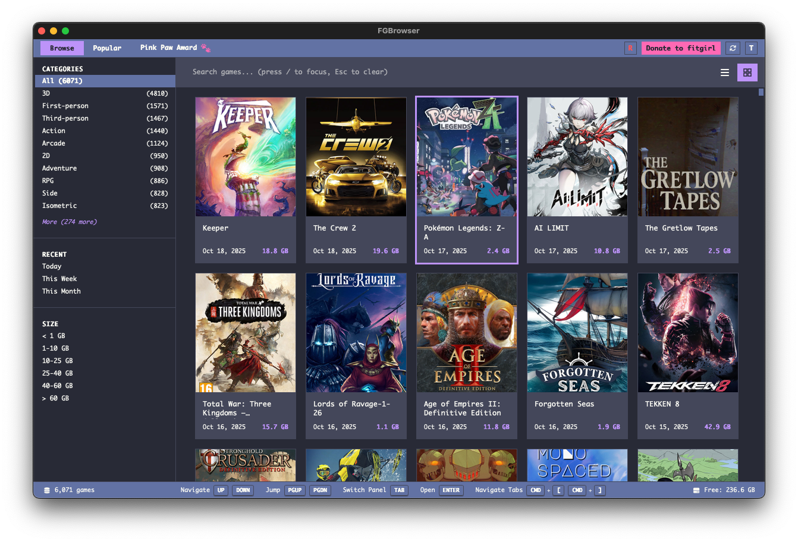

# FGBrowser

A desktop application for browsing and organizing FitGirl Repack information.



> **This application is currently in active development.** While functional, you may encounter bugs, errors, or unexpected behavior. Please report any issues you find on the [GitHub Issues](https://github.com/nodtOx/FGBrowser/issues) page.

## Features

- **Fast Browsing**: Search and filter thousands of games instantly
- **Built-in Crawler**: Rust-based web crawler integrated into the app
- **Auto-Updates**: Automatically fetches new games in the background
- **Beautiful UI**: Modern, responsive interface with dark/light themes
- **Popular Games**: View trending repacks by month and year
- **Download Management**: Track and manage your downloads
- **Offline Ready**: Browse games without internet after initial crawl
- **Image Caching**: Automatic caching of game cover images
- **Multiple Views**: Grid and list view options
- **Auto-Update**: Automatic updates via GitHub releases

## Download

Download the Windows installer from [GitHub Releases](https://github.com/nodtOx/FGBrowser/releases):

**`FGBrowser_*_x64-setup.exe`**

Run the installer and start browsing FitGirl Repacks!

## Development

```bash
# Install dependencies
npm install

# Run in development mode
npm run tauri dev

# Build for production
make build
```

## How It Works

1. Browse thousands of games with instant search and filtering
2. View detailed information including size, languages, and descriptions
3. Copy magnet links to use with your torrent client
4. Track trending games by month and year
5. All data is stored locally for offline browsing

## Privacy

Anonymous telemetry(Sentry) is enabled to help improve the app. No personal data or game information is collected - only crash reports and usage statistics.

## Roadmap:

- Include game updates
- Global application Settings
- Built-in torrent client (not decided yet)

## Disclaimer

This application does not host, create, or distribute any game files. It only aggregates and displays publicly available information and torrent magnet links from FitGirl Repacks website. Users are responsible for ensuring they have legal rights to download any content.
